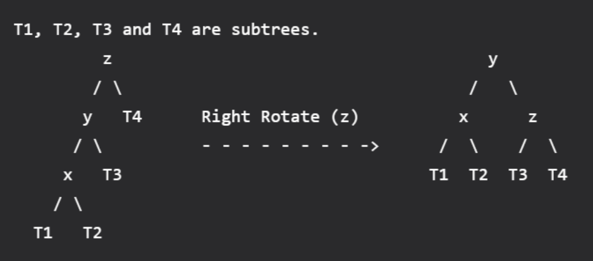

# Linked Lists

A linked list consists of nodes where each node contains a data field and a reference(link) to the next node in the list.



### Implementation in C++ using Class:

#### Node

```cpp
class Node {
public:
    int data;
    Node* next;

    // Default constructor
    Node() {
        data = 0;
        next = nullptr;
    }

    // Constructor
    Node(int data) {
        this->data = data;
        this->next = nullptr;
    }
};
```

#### Linked List Class:

```cpp
class LinkedList {
    Node* head;

public:
    // Default constructor
    LinkedList() {
        head = nullptr;
    }

    void insertNode(int); // Insert node to the end of linked list
    void printList();
    void deleteNode(int); // Delete node at given position
};
```

#### Insert function:

```cpp
void LinkedList::insertNode(int data) {
    Node* newNode = new Node(data);

    if(head == nullptr) { // If no head, assign new node to head
        head = newNode;
        return;
    }

    Node* temp = head;
    while(temp->next != nullptr) {  // Traverse until end
        temp = temp->next;
    }

    temp->next = newNode;
}
```

#### Delete node function:

```cpp
void LinkedList::deleteNode(int position) {
    Node* temp1 = head, *temp2 = nullptr;
    int ListLen = 0;

    if(head == nullptr) return;

    while(temp1!=nullptr) {
        temp1 = temp1->next;
        ListLen++; // Find legnth of list
    }

    if(ListLen < position) return; // Check if the position is in the list or not

    temp1 = head;

    // Delete head
    if(position==1) {
        head = head->next;
        delete temp1;
        return;
    }

    while(position-- > 1) { // Traverse list to find node that need to be deleted
        temp2 = temp1;
        temp1 = temp1->next;
    }

    temp2->next = temp1->next;

    delete temp1;
}
```

#### Print list function:

```cpp
void LinkedList::printList() {
    Node* temp = head;
    
    if(head==nullptr) return;

    while(temp!=nullptr) {
        cout<<temp->data<<" ";
        temp = temp->next;
    }
}
```

#### Example main program:

```cpp
int main() {
    LinkedList list;
    list.insertNode(7);
    list.insertNode(8);
    list.insertNode(9);

    list.printList();
    cout<<endl;

    list.deleteNode(1);
    list.printList();
}
```

Output:

```
7 8 9 
8 9
```
