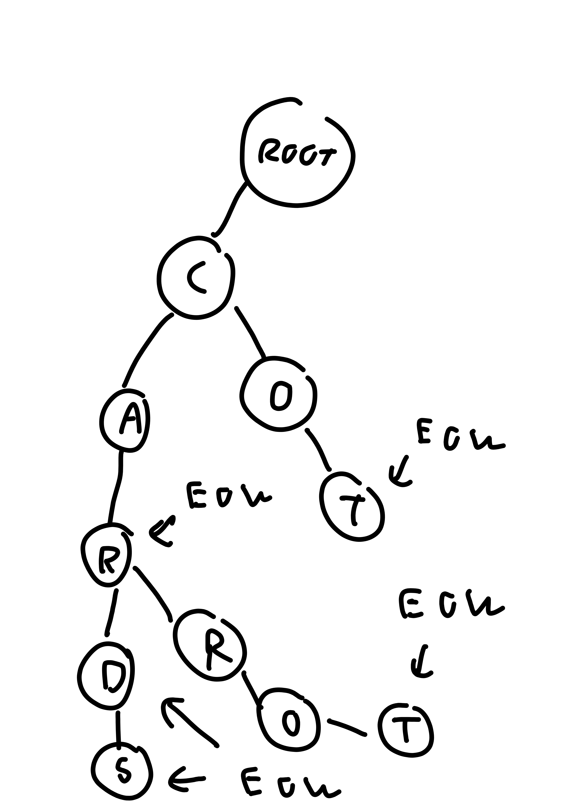

# 3 Tries

A Trie data structure is a tree-like data structure used for efficient storage and retrieval of strings. In a Trie, each node represents a single character of a string. Starting at the root of the tree, each level represents a successive character in the string. The path from the root to a leaf node represents a complete string. A node can have a character as its value and a flag that mark if it is the end of a valid word.&#x20;

Tries can be implemented using arrays or linked lists to represent the children of each node. In my below implementation, I implemented it using hashmap (or dictionary) in python.&#x20;

```python
class TrieNode():
    def __init__(self):
        self.children = {}
        self.isEOW = False

class Trie(object):

    def __init__(self):
        self.root = TrieNode()

    def insert(self, word):
        cur = self.root 
        for c in word:
            if c not in cur.children:
                cur.children[c] = TrieNode()
            cur = cur.children[c]
        cur.isEOW = True
        

    def search(self, word):
        cur = self.root
        for c in word:
            if c not in cur.children:
                return False
            cur = cur.children[c]
        return cur.isEOW

    def startsWith(self, prefix):
        cur = self.root
        for c in prefix:
            if c not in cur.children:
                return False
            cur = cur.children[c]
        return True
```


<figure><figcaption></figcaption></figure>
